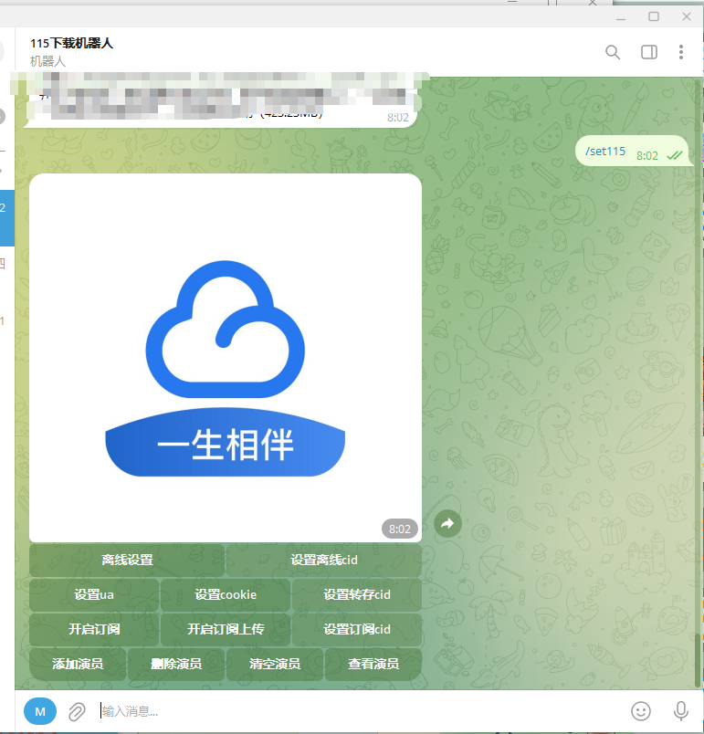

# 115bot 部署指南

## 📋 前置要求

- Docker 已安装并运行
- Telegram Bot Token（从 [@BotFather](https://t.me/BotFather) 获取）用于tg交互以及cookies配置
- Telegram API ID 和 API Hash（从 [https://my.telegram.org/](https://my.telegram.org/) 申请，**可选**）

---

## 📝 配置文件

创建 `application.properties.txt` 文件，内容如下：

```properties
# 必填项
# 机器人 token，从 @BotFather 获取
bot.token=xxx

# 可选项
# 开启 TG 视频转存 115 需要 apiId 和 apiHash
# 没有请到 https://my.telegram.org/ 申请
bot.apiId=xxx
bot.apiHash=xxx

# 可选项
# 许愿树开关
xyssWitch=true

# 答谢空间，单位：GB
rewardSpace=5

# 许愿定时器：从 1 点开始每 8 小时的 10 分钟执行
wishcron=0 10 1/8 * * ?

# 助愿定时器：从 1 点开始每 8 小时的 15 分钟执行
replycron=0 15 1/8 * * ?

# 采纳定时器：从 1 点开始每 8 小时的 20 分钟执行
adoptcron=0 20 1/8 * * ?

# 许愿树账号不能重复
# 助愿账号（cookie）
reply1=cookie1
reply2=cookie2

# 许愿账号（cookie）
wish1=cookie1
wish2=cookie2
```

---

## 🚀 部署步骤

```bash
# 1. 创建数据目录
mkdir -p /vol1/1000/Docker/115bot

# 2. 将配置文件保存为 application.properties.txt 放入该目录

# 3. 运行容器
docker run -d \
  --name 115bot \
  -p 8001:8001 \
  -v /vol1/1000/Docker/115bot/application.properties.txt:/application.properties \
  -v /vol1/1000/Docker/115bot:/115bot \
  --restart=always \
  okhao/115bot:latest
```

---

## 🌐 访问地址

部署成功后，tg机器人即可交互 

---

## ⚠️ 注意事项

- Telegram API ID 和 API Hash 需要到 [https://my.telegram.org/](https://my.telegram.org/) 申请

---

## 📚 相关链接

- [115bot 官方镜像](https://hub.docker.com/r/len996/115bot)
- [Telegram Bot API 文档](https://core.telegram.org/bots/api)
- [Subsonic API 规范](https://www.subsonic.org/pages/api.jsp)

- 

## 图片展示
无限流量代挂 联系


界面展示

